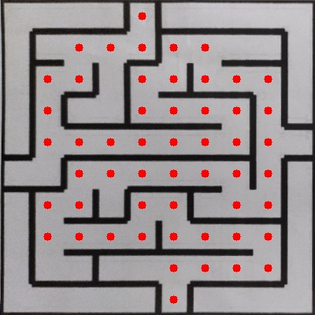
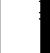
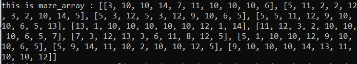
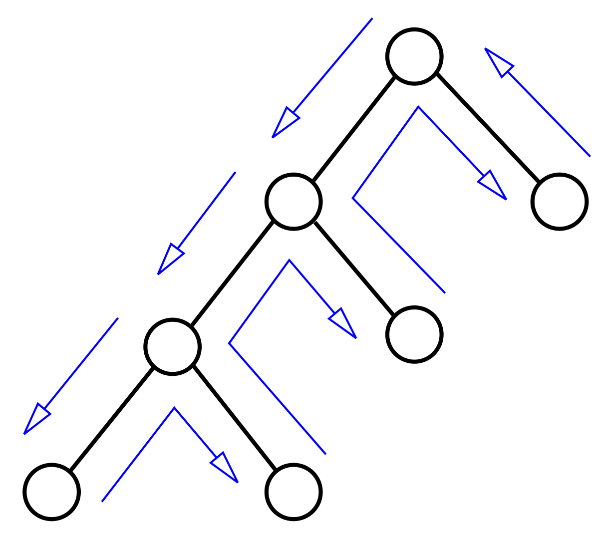
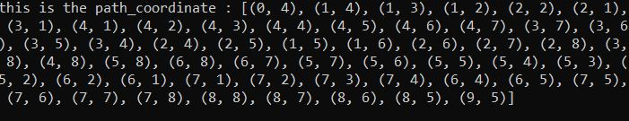

# Maze solver using opencv

You've probably come across maze puzzles in publications and news clips. Have you ever wondered if your computer can perform the task for you? So today we'll learn how to use opencv in Python to create a maze problem solver.
Note- this code will work only for 10 x 10 maze but you can modify it according to your requirement.

<br>



     


                   
So lets start by importing the libraries
```
import cv2
import numpy as np
``` 
       


Now we read the images ,apply perspective transform to this image and resize it to 400 X 400.

So what does perspective transform do??
Well,We can shift the perspective of a given image or video using Perspective Transformation to gain greater insights into the required information. We need to specify the points on the image from which we wish to obtain information by changing the perspective in Perspective Transformation. We must also supply the points inside which we want our image to be displayed. The perspective transform is then computed from the two sets of points and wrapped around the original image.

                  


So as you can see above this function does three things-
1. isolate the maze form the border.
2. resize the maze into 400 X 400 (in pixels).
3. it removes the colour channel of the image.


Here is the code
```
def applyPerspectiveTransform(input_img):
 
    """
    Purpose:
    ---
    takes a maze test case image as input and applies a Perspective           Transfrom on it to isolate the maze
 
    Input Arguments:
    ---
    `input_img` :   [ numpy array ]
        maze image in the form of a numpy array
 
    Returns:
    ---
    `warped_img` :  [ numpy array ]
        resultant warped maze image after applying Perspective Transform
 
    Example call:
    ---
    warped_img = applyPerspectiveTransform(input_img)
    """
    
 
    warped_img = None
 
    ##############  ADD YOUR CODE HERE  ##############
   
    def changed(img):
        imgGray = cv2.cvtColor(img,cv2.COLOR_BGR2GRAY)
        imgBlur = cv2.GaussianBlur(imgGray,(5,5),1)
        imgThreshold = cv2.adaptiveThreshold(imgBlur,255,1,1,11,2)
        return imgThreshold
    def large(contours):
        biggest = np.array([])
        max_area = 0
        for i in contours:
            area = cv2.contourArea(i)
            if area >5000:
                peri = cv2.arcLength(i,True)
                approx = cv2.approxPolyDP(i,0.02 * peri,True)
 
                if area >max_area and len(approx) ==4:
                    biggest = approx
                    max_area = area
        return biggest,max_area
    def inorder(myPointes):
        myPointes = myPointes.reshape((4,2))
        myPointesNew = np.zeros((4,1,2),dtype=np.int32)
        add = myPointes.sum(1)
        myPointesNew[0] = myPointes[np.argmin(add)]
        myPointesNew[3] = myPointes[np.argmax(add)]
        diff = np.diff(myPointes,axis=1)
        myPointesNew[1] = myPointes[np.argmin(diff)]
        myPointesNew[2] = myPointes[np.argmax(diff)]
        return myPointesNew
    heightImg = 400
    widthImg  = 400
    img = cv2.resize(input_img,(widthImg,heightImg))
    imgThreshold = changed(img)
    imgContours = img.copy()
    imgBigContour = img.copy()
    contours,hierarchy = cv2.findContours(imgThreshold,cv2.RETR_EXTERNAL,cv2.CHAIN_APPROX_SIMPLE)
    cv2.drawContours(imgContours,contours,-1,(0,255,0),3)
    biggest,maxArea = large(contours)
    if biggest.size !=0:
        biggest = inorder(biggest)
        cv2.drawContours(imgBigContour,biggest,-1,(0,255,0),10)
        pts1 = np.float32(biggest)
        pts2 = np.float32([[0,0],[widthImg,0],[0,heightImg],[widthImg,heightImg]])
        matrix = cv2.getPerspectiveTransform(pts1,pts2)
        imgWarpColored = cv2.warpPerspective(img,matrix,(widthImg,heightImg))
        gray = cv2.cvtColor(imgWarpColored, cv2.COLOR_BGR2GRAY)
        blurred = cv2.GaussianBlur(gray, (1,1),0)
        thresh = cv2.threshold(blurred,80,255,cv2.THRESH_BINARY)[1]
    ##############################
    
    return thresh,imgWarpColored
```
 


Once we have the isolated maze image . now we have to form a maze array.
## For this we have to read maze block by block

<br>


when maze is on the left   then Edge = 2<sup>0</sup> =1

<br>
<br>


when maze is up then Edge = 2<sup>1</sup> = 2
<br>
<br>
<br>
            
        
when maze is on the right then Edge = 2<sup>2</sup>=4
<br>
<br>
<br> 
  

when maze is down then Edge = 2<sup>3</sup>=8

<br>

Now lets combine this rule


In this case we have maze on UP,LEFT,DOWN So Edge= 2<sup>0</sup>+2<sup>1</sup>+2<sup>3</sup>=11

<br>

### Similarly


Edge = 2<sup>2</sup>+2<sup>3</sup>=12

<br>
Now lets code this
<br>


```
def detectMaze(warped_img):
 
    """
    Purpose:
    ---
    takes the warped maze image as input and returns the maze encoded in form of a 2D array
 
    Input Arguments:
    ---
    `warped_img` :    [ numpy array ]
        resultant warped maze image after applying Perspective Transform
 
    Returns:
    ---
    `maze_array` :    [ nested list of lists ]
        encoded maze in the form of a 2D array
 
    Example call:
    ---
    maze_array = detectMaze(warped_img)
    """
 
    maze_array = []
 
    ##############  ADD YOUR CODE HERE  ##############
    for i in range(20,380,40):
        llt = []
        for j in range(20,380,40):
            c = 0
            if ((warped_img[i,j+20] == 0) or (warped_img[i,j+19] == 0) or (warped_img[i,j+18] == 0) or (warped_img[i,j+21]==0)):
                c += 4
            else:
                pass
            llt.append(c)
        maze_array.append(llt)
    for i in range(0,9):
        maze_array[i].append(0)
    a = []
    for j in range(20, 380, 40):
        c = 0
        if ((warped_img[380, j + 20] == 0) or (warped_img[380, j + 19] == 0) or (warped_img[380, j + 18] == 0) or (warped_img[380, j + 21] == 0)):
            c += 4
        a.append(c)
    a.append(0)
    maze_array.append(a)
    for i in range(0,10):
        for j in range(0,10):
            if (maze_array[i][j]==4) or (maze_array[i][j]==5):
                maze_array[i][j+1]=maze_array[i][j+1] +1
 
    v_maze =[]
    for i in range(20,380,40):
        llt = []
        for j in range(20,380,40):
            c = 0
            if ((warped_img[i+20,j] == 0) or (warped_img[i+19,j] == 0) or (warped_img[i+18,j] == 0) or (warped_img[i+21,j]==0)):
                c += 8
            else:
                pass
            llt.append(c)
        v_maze.append(llt)
    v_last = [0,0,0,0,0,0,0,0,0,0]
    v_maze.append(v_last)
    k=0
    for j in range(20, 380, 40):
        if ((warped_img[j + 20,380] == 0) or (warped_img[j + 19,380] == 0) or (warped_img[j + 18,380] == 0) or (warped_img[j + 21,380] == 0)):
            v_maze[k].append(8)
            k=k+1
        else:
            v_maze[k].append(0)
            k=k+1
    for i in range(0,10):
        for j in range(0,10):
            if (v_maze[i][j]==8) or (v_maze[i][j]==10):
                v_maze[i+1][j]=v_maze[i+1][j]+2
 
    matrix = np.zeros((10,10),dtype=np.int32)
    for i in range(10):
        for j in range(10):
            matrix[i][j] = maze_array[i][j] + v_maze[i][j]
 
    for i in range(10):
        matrix[0][i] = matrix[0][i] +2
        matrix[9][i] = matrix[9][i] + 8
    for i in range(10):
        matrix[i][0] = matrix[i][0] +1
        matrix[i][9] = matrix[i][9] +4
    matrix_list = matrix.tolist()
        
    maze_array = matrix_list
    print("this is maze_array :",maze_array)
    ##################################################
    return maze_array
```

### The above code returns the Maze array



<br>
<br>


Now solving the maze has come down to solving the maze array


We can solve this maze using various algorithm but i will use backtracking as it is easy to understand.

<br>


Backtracking is an algorithmic strategy for recursively solving problems by attempting to develop a solution progressively, one piece at a time, and discarding any solutions that do not satisfy the problem's criteria at any point in time.


```

def find_path(maze_array, start_coord, end_coord):
    """
    Purpose:
    ---
    Takes a maze array as input and calculates the path between the
    start coordinates and end coordinates.
 
    Input Arguments:
    ---
    `maze_array` :   [ nested list of lists ]
        encoded maze in the form of a 2D array
 
    `start_coord` : [ tuple ]
        start coordinates of the path
 
    `end_coord` : [ tuple ]
        end coordinates of the path
    
    Returns:
    ---
    `path` :  [ list of tuples ]
        path between start and end coordinates
    
    Example call:
    ---
    path = find_path(maze_array, start_coord, end_coord)
    """
 
 
 
    ################# ADD YOUR CODE HERE #################
    sp = []
    rec = [0]
    hi=[]
    p = 0
    h=0
    w=0
    
    initial_point=start_coord
    
    final_point=list(end_coord)
    t=maze_array
    for i in range(0,10):
        for j in range(0,10):
           t[i][j]=15-t[i][j]
    meta=t
    sp.append(list(initial_point))
    
    while True:
    
       h,w = sp[p][0],sp[p][1]
     
 
       if(sp[-1]==final_point ):
          
            break
       if meta[h][w] > 0:
           rec.append(len(sp))
   
      #open in downward
       if(meta[h][w]>=8):
        
          meta[h][w]=meta[h][w]-8
          h=h+1
          sp.append([h,w])
       
          meta[h][w] =meta[h][w]-2
          p = p+1
          continue
        #open in right
       if(meta[h][w]>=4):
        
          meta[h][w]=meta[h][w]-4
          w=w+1
          sp.append([h,w])
          meta[h][w] =meta[h][w]-1
          p = p+1
          continue
     #open in upward
       if(meta[h][w]>=2):
        
          meta[h][w]=meta[h][w]-2
          h=h-1
          sp.append([h,w])
          meta[h][w] =meta[h][w]-8
          p = p+1
          continue
     
     
     #open in left
       if(meta[h][w]>=1):
        
          meta[h][w]=meta[h][w]-1
          w=w-1
          sp.append([h,w])
          meta[h][w] =meta[h][w]-4
          p = p+1
          continue
      
     
     
     
       else:
    #Removing the coordinates that are closed or don't show any path   
          sp.pop()
      
          rec.pop()
          if (rec==[]):
              sp=None
              break
       
          p = rec[-1]
      
    if(sp!=None):
       for i in range (0,len(sp)):
           hi.append((sp[i][0],sp[i][1]))
 
    else:
        hi=None
 
 
 
    ######################################################
    print('this is the path_coordinate :',hi)
    return hi


```
The variable hi give us the list of (x,y) coordinate which we can use to highlight the path.




Now lets highlight the path using this function

```
def pathHighlight(img, ip, fp, path):
   CELL_SIZE = 40
   er=[]
   
   for cor in path:
     #print(cor)
     h= CELL_SIZE*(cor[0]+1)
     w=CELL_SIZE*(cor[1]+1)
     h0=CELL_SIZE*(cor[0])
     w0=CELL_SIZE*(cor[1])
     t=img[h0:h,w0:w]
     a,b=int((40)/2),int((40)/2)
     er.append([h-20,w-20])
     t = cv2.circle(t,(a,b) , 5, (0,0,255) , -1)
  
   return img

```
This function will return


            
